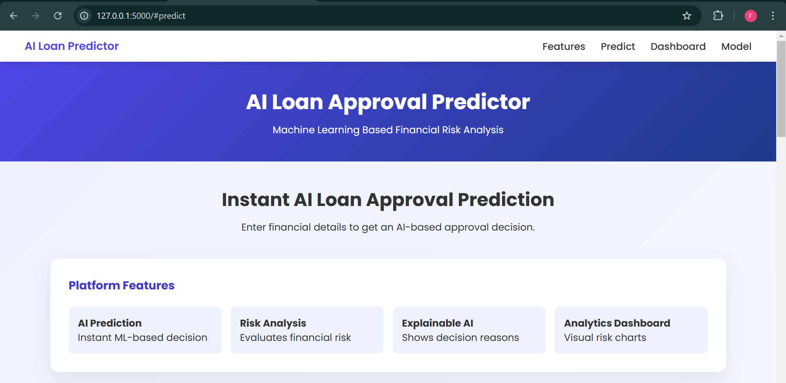
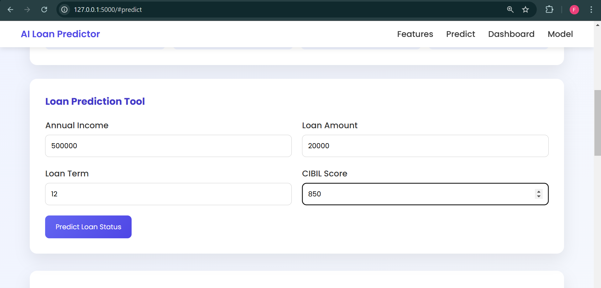
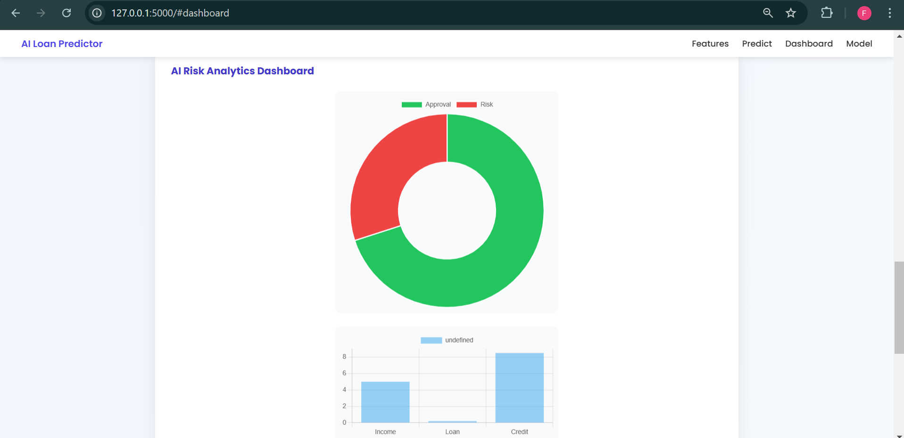

<<<<<<< HEAD
<h1 align="center">AI Loan Approval Prediction System</h1>

A Machine Learning powered web application that predicts loan approval status based on financial risk indicators.

---

# Overview

The **AI Loan Approval Prediction System** is a Machine Learning based web application that predicts whether a loan application will be **approved or rejected** based on financial details such as applicant income, loan amount, loan term, and credit score.

This project demonstrates the **end-to-end workflow of deploying a Machine Learning model into a web application**, combining data processing, model training, and a user-friendly interface.

The system simulates how financial institutions evaluate loan applications using **data-driven financial risk analysis**.

---

# Project Highlights

- Machine Learning based loan approval prediction system
- End-to-end ML pipeline from dataset to web deployment
- Integration of trained ML model with Flask backend
- Simple and user-friendly web interface
- Demonstrates real-world financial risk prediction concepts

---

# Features

- Predict loan approval status instantly
- User-friendly web interface
- Fast prediction results
- Machine Learning powered backend
- End-to-end ML pipeline (Data → Model → Web App)

---

# Technologies Used

## Programming Language
- Python

## Machine Learning Libraries
- Pandas
- NumPy
- Scikit-learn
- Joblib

## Backend Framework
- Flask

## Frontend
- HTML
- CSS
- JavaScript

## Development Tools
- Visual Studio Code
- Git
- GitHub

---

# Project Structure

loan-approval-prediction-system
│
├── dataset
│ └── loan_data.csv
│
├── model
│ ├── train_model.py
│ └── loan_model.pkl
│
├── backend
│ └── app.py
│
├── frontend
│ └── index.html
│
├── requirements.txt
└── README.md

---

# Machine Learning Model

### Algorithm Used
Random Forest Classifier

### Machine Learning Workflow

1. Data Collection  
2. Data Preprocessing  
3. Feature Selection  
4. Model Training  
5. Model Evaluation  
6. Model Deployment  

The trained model predicts whether a loan should be **approved or rejected** based on the provided financial inputs.

---

# Installation

## Clone the Repository

git clone https://github.com/YOUR-GITHUB-USERNAME/loan-approval-prediction-system.git

## Navigate to the Project Directory

cd loan-approval-prediction-system

## Install Dependencies

pip install -r requirements.txt

---

# Running the Project

## Step 1 Train the Machine Learning Model

python model/train_model.py

This will generate the trained model file:

loan_model.pkl

## Step 2 Run the Flask Backend Server

python backend/app.py

## Step 3 Open the Web Application

Open your browser and go to:

http://127.0.0.1:5000

---

# Input Parameters

| Parameter | Description |
|----------|-------------|
| Applicant Income | Annual income of the applicant |
| Loan Amount | Requested loan amount |
| Loan Term | Loan repayment duration |

Based on these inputs, the system predicts:

- Loan Approved
- Loan Rejected

---

# Example Workflow

1. User enters loan details in the web interface  
2. Input data is sent to the Flask backend  
3. The trained Machine Learning model processes the input  
4. The system returns the prediction result  
5. The result is displayed on the web interface  

---

# Screenshots

### Home Page

### Loan Prediction Page

### Dashboard

---

# Demo Video

Watch the working demo of the project here:

https://youtu.be/0bkLj3Fxr8E

---

# Future Improvements

- Include additional financial features for better prediction accuracy
- Implement multiple ML models for comparison
- Improve UI with modern frontend frameworks
- Deploy the application on cloud platforms (AWS / Render / Heroku)

---

# Author

**Faridha Banu**  
B.Tech CSE (Data Science)

---

# License

This project is developed for **educational and learning purposes**.
=======
# loan-approval-prediction-system
Machine Learning based web application that predicts loan approval using financial risk indicators.
>>>>>>> a5ba3b95fabd1ecd886f7f2f783ca5bafca8032c
